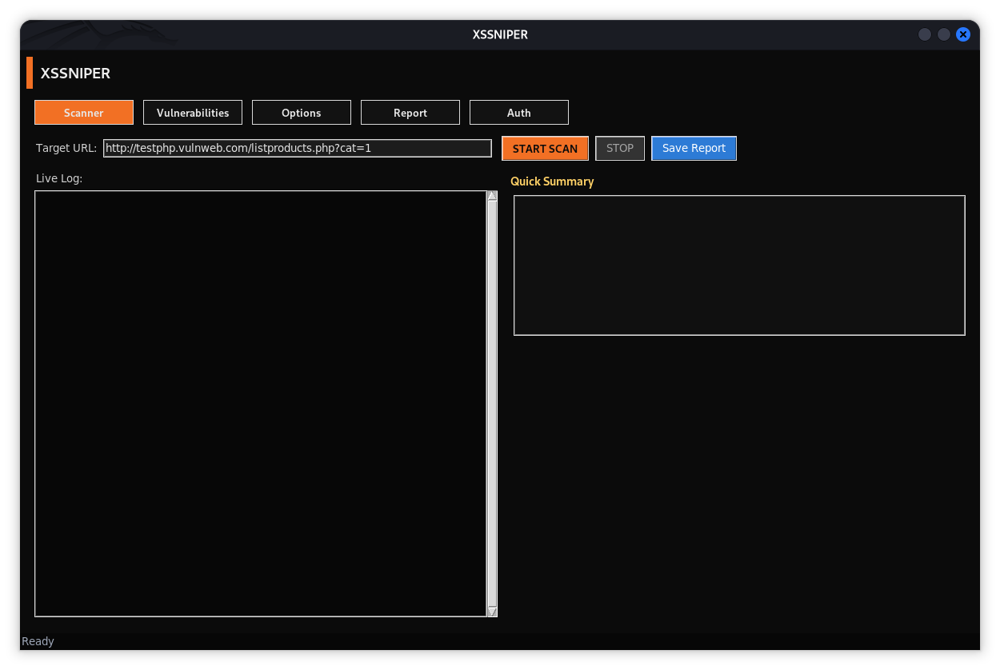

---

# **XSSNIPER** — Advance Cross-Site Scripting

`XSSNIPER` is a desktop application for security analysts to identify and validate **client-side and server-side XSS vulnerabilities** in web applications.
It is designed for penetration testing teams, red teams, and security researchers who require accurate payload context detection, automatic DOM analysis, and reporting capabilities aligned with bug bounty submission workflows.

---
## 🎥 Demonstration Video

<p align="center">
  <a href="https://github.com/H4CKMAHII/XSSNIPPER/blob/main/assets/xssniper.mp4?raw=true">
    
  </a>
</p>

> Click the image to watch/download the demo video.


## **Core Capabilities**

### **Vulnerability Detection**

* Reflected XSS (HTML / Attribute / JavaScript / URL contexts)
* DOM-based XSS via optional Selenium browser automation
* Stored XSS via automatic form submission
* Blind XSS with external OAST/Webhook integration
* Server-Side Template Injection (SSTI) heuristic discovery
* Prototype Pollution testing (DOM / client-side)

### **Analysis & Intelligence**

* Multi-vendor WAF fingerprinting & behavioral assessment
* Automatic link exploration (same-origin crawler)
* Parameter extraction from URLs and forms
* Context-aware payload selection + mutation engine
* JavaScript sink tracing for DOM sinks (eval, innerHTML, etc.)
* Account Takeover (ATO) chain indicators

### **Interoperability**

* Optional integration with `nuclei` templates for extended coverage
* Burp-compatible JSON exports for interoperability
* Selenium WebDriver support for graphical execution tracing

### **Reporting**

Multiple export formats suitable for corporate and bug bounty workflows:

* `HTML` — styled security assessment report
* `CSV` — platform submission format
* `JSON` — Burp-compatible issue format

Each report includes:

* Vulnerability class & confidence level
* Payload grouping and coverage summary
* Reproduction details (PoC URL, parameters)
* Suggested remediation measures

---

## **Platform Architecture**

| Component             | Function                                       |
| --------------------- | ---------------------------------------------- |
| Request Engine        | HTTP(S) request execution & session management |
| Crawler               | Depth-limited same-domain link enumeration     |
| Payload Engine        | Context-based payload generation & mutation    |
| DOM Engine (optional) | XSS execution validation in browser context    |
| Reporting Module      | CSV/JSON/HTML structured output                |
| Auth Module           | Form / Header / Token authentication           |
| WAF Detector          | Header & behavioral fingerprinting             |

---

## **Technical Features**

* Multi-threaded scanning engine
* Support for GET & POST vectors
* Context detection for accurate payload insertion
* Payload mutation for bypass techniques
* Deduplication & vulnerability grouping
* Traceable PoC construction
* Adjustable worker count & crawl depth
* Blind payload support via Webhook URL
* TLS/SSL support

---

## **System Requirements**

### **Mandatory**

* Python 3.9+
* Linux, Windows, or macOS

### **Python Dependencies**

```
requests
bs4
tkinter (standard library)
```

### **Optional Components**

| Feature           | Requirement                      |
| ----------------- | -------------------------------- |
| DOM XSS rendering | Selenium + Firefox + Geckodriver |
| Extended scanning | nuclei binary                    |
| Blind XSS         | Valid OAST/Webhook endpoint      |

---

## **Installation**

### **Clone Repository**

```bash
git clone https://github.com/H4CKMAHII/xssniper.git
cd xssniper
```

### **Install Dependencies**

```bash
pip install -r requirements.txt
```

### **Optional: Install Selenium Support**

```bash
pip install selenium
# Install geckodriver for Firefox
```

### **Optional: Install nuclei**

```bash
sudo apt install nuclei
```

---

## **Execution**

### **Launch Application**

```bash
python3 xssniper.py
```

---

## **User Interface Overview**

XSSNIPER provides a multi-tab analyst interface:

| Tab                 | Purpose                                        |
| ------------------- | ---------------------------------------------- |
| **Scanner**         | Configure target and start the assessment      |
| **Vulnerabilities** | View identified findings and payloads          |
| **Options**         | Set worker threads, crawl depth, webhook, etc. |
| **Report**          | Generate structured reports (CSV/JSON/HTML)    |
| **Auth**            | Configure authentication methods               |

---

## **Authentication Support**

XSSNIPER supports authenticated testing via:

| Mode         | Description                                 |
| ------------ | ------------------------------------------- |
| Form-Based   | Login POST form submission                  |
| Header-Based | Authorization header insertion              |
| Token-Based  | Token acquisition + header/cookie placement |

---

## **Blind XSS (OAST) Support**

The platform allows webhook/OAST endpoints for blind payload callbacks.
Analysts may integrate with SecurityTrails, interactsh, Burp Collaborator, etc.

---

## **Use Cases**

* Internal security assessments
* External penetration testing engagements
* Bug bounty reconnaissance
* Browser-based DOM exploitation research
* Red team infrastructure validation
* CI/CD integration (via reporting formats)

---

## **Compliance & Ethics Notice**

This software is intended exclusively for **authorized security testing and research**.
Testing without permission may violate local and international laws.

---

## **License**

Distributed under the MIT License.

---

## **Contribution**

Feature requests, enhancements, and pull requests are welcome.
Please open an Issue for major architectural discussions.

---


